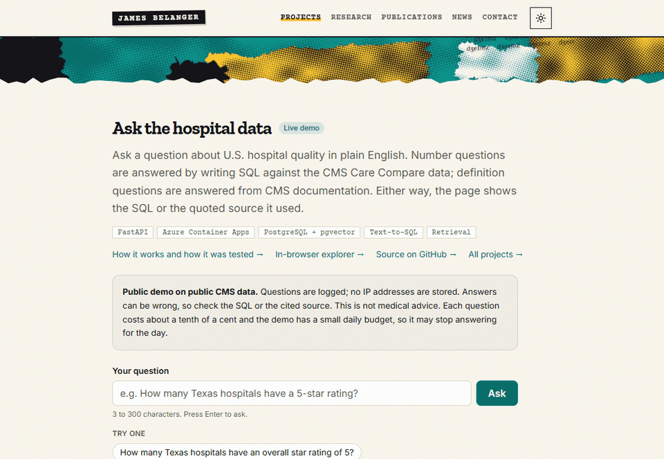
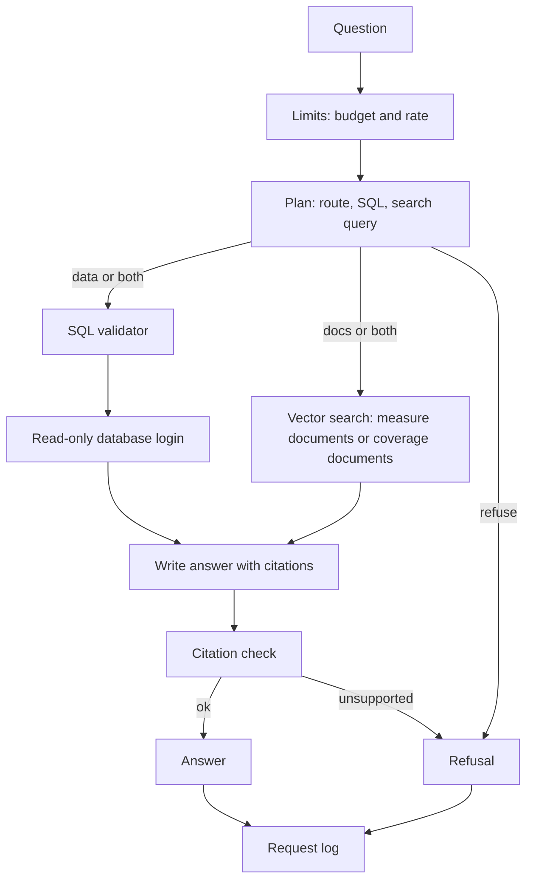

# Hospital Quality: ask the data

A question-answering service over CMS hospital-quality data and Medicare national coverage policy. You type a plain-English question. A language model either writes SQL against the hospital tables, finds the relevant passage in CMS documentation (measure definitions, or Medicare National Coverage Determinations), or declines. Every answer shows its evidence: the SQL and the rows it returned, or a quoted passage with its source. The repository also holds the original BI project this grew out of (ETL, a Postgres schema, twelve SQL exercises, an interactive explorer).

**Who built it.** Designed and directed by James Belanger; implemented with AI coding agents (Claude Code). This is a public demo and portfolio project, not a production system at a company.

- **Try it:** [Ask page](https://jamesbelanger.com/projects/hospital-quality/ask/) (runs on a small service that sleeps when idle, so the first question can be slow)
- **Case study:** [how it works and how it was tested](https://jamesbelanger.com/projects/hospital-quality/)
- **Explorer:** [in-browser hospital explorer](https://jamesbelanger.com/projects/hospital-quality/explore/)



## What it does

Real output from the service, cost and time as reported with each answer (the first, second and fourth from the live page at release `38f8ae1`).

**A number question.** "Which five Texas counties have the most hospitals, and how many does each have?"

> The five Texas counties with the most hospitals are Harris (50), Dallas (30), Tarrant (30), Bexar (20), and Denton (17).

```sql
SELECT county, COUNT(*) AS hospital_count FROM hq.hospitals
WHERE UPPER(state) = UPPER('TX') AND county IS NOT NULL
GROUP BY county ORDER BY hospital_count DESC, county LIMIT 5
```

The page also shows the five rows. 7.8 s, $0.0010.

**A definition question.** "Who is surveyed in HCAHPS, and when after discharge?"

> HCAHPS surveys a random sample of adult inpatients (18 years and older) who were admitted for Medical, Surgical, or Maternity Care. The survey is administered between 48 hours and 42 days after discharge.

Cited: *HCAHPS Fact Sheet (CAHPS Hospital Survey), December 2024*, section "Administration of the Updated HCAHPS Survey", p. 2, with the quoted passage. 6.9 s, $0.0012.

**A coverage question.** "Does Medicare cover acupuncture for chronic low back pain, and under what conditions?"

> Yes. NCD 30.3.3, Acupuncture for Chronic Lower Back Pain (cLBP), covers acupuncture for services performed on or after January 21, 2020, for cLBP lasting 12 weeks or longer that is nonspecific, has no identifiable systemic cause, and is not associated with surgery or pregnancy. Up to 12 visits are covered in 90 days; an additional 8 sessions are covered if the patient demonstrates improvement, with no more than 20 treatments annually. [...] This is national Medicare policy as written in that document; local rules and individual circumstances can differ, and it is not a coverage decision for any person.

Cited: nine quoted passages from NCD 30.3.3, each checked against the stored text, with a link to the determination on cms.gov. Run from the command line on the build that adds coverage: 15.8 s, $0.0018. The same question asked about one person ("Will Medicare pay for my CPAP machine?") is declined.

**One it declines.** "Which individual cardiologists in Houston have the best patient outcomes?"

> It declined to answer. The database reports quality measures for hospitals, not individual cardiologists or physician-level outcomes.

No SQL is run and no documentation is cited. Declining is a normal outcome by design.

## How a question flows



The planner is one model call that returns a route (`data`, `docs`, `both` or `refuse`), the SQL if any, a rewritten documentation search query if any, and which of the two document sets to search (`measures` or `coverage`). A search never mixes the two sets. If no path produces evidence, the answer is a refusal and the answer call is skipped. Details: the docstring in `service/pipeline.py`.

Safeguards:

- **Two independent SQL defenses.** `service/sql_guard.py` accepts only a single `SELECT` (CTEs and set operations allowed; no recursion), rejects writes, DDL, `COPY`, `SET`, locks and `SELECT ... INTO`, allows only eight named tables and views in schema `hq` (names are resolved scope by scope), allows only functions on an explicit list of analytics functions, and caps results at 200 rows. The query then runs under a database login (`hq_reader`) that can only `SELECT` from `hq`, in read-only transactions with a 5-second timeout.
- **Separate logins by job.** The documentation search login can read only `hq_docs.chunks`. The logging login can only insert into and select from `hq_app.request_log`. Neither the reader nor the search login can read the log. Created by `infra/setup_reader_role.py`.
- **Citations are checked.** A citation with an unknown chunk id, or a quote that is not in that chunk, is dropped. A documentation answer left with no valid citation becomes a refusal.
- **Weak documentation matches are not used.** A passage is kept only if its best vector similarity reaches 0.35.
- **Limits that survive restarts.** The daily budget ($0.50 of model spend per UTC day), per-client rate (20 an hour) and overall rate (30 a minute) are computed from the request log plus the requests still being answered, before any model call. At most 6 questions are answered at once. If the log cannot be read, `/ask` returns 503 rather than run unmetered. Questions are capped at 300 characters. The log stores a salted hash of the client address, not the address.
- **Bounded output.** The question is treated as data, not instructions: requests to change tone, persona, format or wording are ignored or declined. Answers are cut at 2,400 characters, result cells at 300, and the coverage closing sentence is added in code if the model leaves it out.
- **Coverage answers are bounded.** They come only from the text of National Coverage Determinations, name the determination, and end by saying this is national policy and not a decision about any person. Questions about what one person will pay, whether their claim will be approved, other insurers, or local coverage rules are declined.
- **An alert outside the service.** A scheduled check reads the request log every 30 minutes and raises an alert when the daily budget is nearly or fully used, or when requests start failing (see [Alerts](#alerts)).
- **Nothing ships on a worse score.** The deploy pipeline runs the tests and the evaluation set and compares against a stored baseline before it builds anything (see [Evaluation](#evaluation) and [What broke](#what-broke)).

## Evaluation

Four question sets, all with known-correct answers. The first three cover hospital quality; the fourth covers Medicare coverage and is reported separately below. Answers are graded like this: number questions by comparing the rows the generated SQL returns with a stored truth query; definition questions by an LLM judge that marks which required points the answer states; decline questions by whether the service refused.

| Set | Questions | Who wrote them | Used for |
|---|---|---|---|
| Test split (of the 75-question v1 set) | 63: 26 number, 22 definition, 4 not in the documents, 11 off-topic or unsafe | An AI agent | Headline scores. The other 12 questions (dev split) were used while writing prompts. Configuration changes were made after seeing test-split results, so it is no longer a clean measure. |
| Holdout | 26: 8 number, 15 definition, 3 not in the documents | An AI agent | Written after retrieval settings and the planner prompt were frozen, without running the system on them. It has been run twice. |
| Second-agent set | 25: 12 number, 9 definition, 4 should decline | Drafted by a second AI agent; reviewed and approved by James | Frozen before the service saw any of them. 14 of the 25 are close to an earlier question. Two were reworded with James's approval before they were run. |

**The judge has not been validated against a person.** The LLM judge that grades definition answers (`gpt-6-sol`) has not been checked against human grading. A second AI agent reviewed a 12-item sample of the judge's verdicts (`evals/JUDGE_CHECK.md`) and agreed with all 12. That is one model checking another on a small selected sample, not human validation.

Each cell is questions answered correctly out of questions asked. Start is the first configuration (run twice); Final is the configuration the live service uses (run three times). These are single runs, and repeat runs of one configuration differed by 1 to 3 questions (final definition scores: 13, 11, 14), so read changes smaller than that as noise.

| Question type | Start, run 1 | Start, run 2 | Final, run 1 | Final, run 2 | Final, run 3 | Holdout | Second-agent set |
|---|---|---|---|---|---|---|---|
| Number (26 test, 8 holdout, 12 second-agent) | 23/26 | 23/26 | 26/26 | 26/26 | 26/26 | 8/8 | 12/12 |
| Definition (22 test, 15 holdout, 9 second-agent) | 13/22 | 12/22 | 13/22 | 11/22 | 14/22 | 11/15 | 7/9 |
| Decline: not in the documents (4 test, 3 holdout) | 4/4 | 4/4 | 4/4 | 3/4 | 4/4 | 3/3 | none in set |
| Decline: off-topic or unsafe (11 test, 4 second-agent) | 11/11 | 11/11 | 11/11 | 11/11 | 11/11 | none in set | 4/4 |
| **Overall** | **51/63** | **50/63** | **54/63** | **51/63** | **55/63** | **22/26** | **23/25** |

Start: `plan_v2`, `schema_v1`, `answer_v3`, hybrid retrieval, 6 passages. Final: `plan_v4`, `schema_v2`, `answer_v4`, vector retrieval, 8 passages. The answering model is `gpt-6-luna`. Reports for every run are in `evals/results/`.

What the table says: number questions went from 23/26 to 26/26 and stayed there. Definition scores did not move beyond run-to-run noise. The second-agent set was run only on the final configuration. Its two reworded questions were fixed before any service output for them was seen, but after the other 23 had scored 21/23.

**After coverage was added.** The planner and answer prompts changed (`plan_v5`, `answer_v5`) to add the second document set. One run of the hospital-quality test split on the new prompts: number 26/26, definition 15/22, not in the documents 4/4, off-topic or unsafe 11/11, 56/63 overall. That passed the release gate; the definition change is inside run-to-run noise.

| Coverage set (30 questions, written by an AI agent) | Dev split (8) | Test split (22), run 1 | Test split, run 2 |
|---|---|---|---|
| What a determination covers and its conditions | 6/6 | 16/16 | 16/16 |
| Decline: no national determination covers it | 1/1 | 2/3 | 2/3 |
| Decline: personal, price, other insurer, or unsafe | 1/1 | 3/3 | 3/3 |
| **Overall** | **8/8** | **21/22** | **21/22** |

How to read the coverage numbers. The questions were written by the same AI agent that built the feature, from the text of 345 determinations, and frozen before the service saw any of them. The 8 dev questions were used to adjust the prompts (one revision). Each question names its item or service, so finding the right determination is easy; 16/16 shows the path works, not that coverage answers are always right. Run 2 exists because review found the answer prompt used one determination as a formatting example and a test question was about that same determination; the example was replaced with a placeholder and the split was run again. The one miss in both runs is a grounded answer ("no general telehealth policy is stated") where the grader accepts only a refusal. The coverage set is not part of the release gate.

**A larger model, not adopted.** Run once on the starting configuration, `gpt-6-sol` scored 26/26 on number questions and 9/22 on definitions, 50/63 overall (against 51/63 for `gpt-6-luna`), at $0.0218 per question against $0.0012, about 19 times as much.

**Cost and latency.** About $0.0013 per question for the answering model on the test split (the judge adds about $0.0009 per question; a full 63-question run costs about $0.14). Median latency 8.1 to 10.4 s and 90th percentile 15.8 to 16.4 s across the three final runs.

## What broke

1. **A "none" that was really a wrong filter.** A query returning zero rows used to be refused; that was changed to answer "no records match." The next evaluation showed two number questions where the model filtered a mixed-case name against capitalized data, got zero rows and said "none" with confidence; a third used a Texas-only view for a national question. Fix: give the planner true facts measured from the database (how text is cased, which states each view covers) and add a re-check when a query returns nothing. Number questions went from 23/26 to 26/26. A count that comes back as 0 is one row, not none, so the re-check cannot catch it, and one holdout question failed that way. Sources: `evals/results/run_*_luna-a.md`, `run_*_luna-v5-a.md`, `run_*_luna-v5-holdout.md`; `evals/README.md` decision (b).
2. **The keyword half of hybrid search matched nothing.** Run alone, keyword search retrieved the expected passage for 0 of 22 definition questions and the service declined 21 of them. The first hybrid score was probably the vector half doing all the work. After keyword search was fixed, the same prompts scored 11/22 on vector alone, 8/22 on hybrid and 5/22 on keyword (five connection errors in that last run, so 5 is a floor). Running each half alone exposed it. Sources: `run_*_luna-keyword.md`, `run_*_luna-vector.md`, `run_*_luna-v3-{a,vector,keyword}.md`.
3. **The retrieval study measured the wrong input.** Hybrid retrieval with 6 passages was picked by scoring raw question text, but the planner rewrites each question into a search query first. Re-scored on the rewritten queries, vector search found the expected passage in the top 6 for 17/22 questions against 15/22 for the chosen setting, and the pre-declared rule picked vector with 8 passages. Sources: `evals/results/retrieval_study_2026-10-06_planner_v4a.md`; `evals/README.md` decision (c).
4. **The release gate blocked a change; the baseline was reset on purpose.** After round 1, number questions rose to 26/26 but definition questions fell to 8/22 and 10/22 in two runs, so the gate failed. The cause was the keyword search above. With vector search restored, definition scores returned to 11 to 14 of 22, inside the 1 to 2 question spread measured between identical runs. The definition tolerance was set to 2 from that spread, and the baseline was reset by James's decision with the reason written in the baseline file. Later the "not in the documents" tolerance went from 0 to 1: with 4 questions, one honest "the documentation does not give the criteria" failed a grader that accepts only an outright refusal. Sources: `evals/baseline.json`; `evals/README.md` decisions log; `run_*_luna-v3-{a,b}.md`.
5. **Some answer keys asked for more than the question did.** One question asks which measure groups feed the star rating and how many stars a hospital can get; its key also requires "most hospitals display three stars." Three definition questions failed in all nine test-split runs on file, which pointed at the keys rather than the system. They have not been rewritten, so treat definition scores as rough. Sources: `run_*_{luna-a,luna-b,sol-a,luna-v3-a,luna-v3-b,luna-v4-a,luna-v5-a,luna-v5-b,luna-v6-a}.md`.
6. **The first deploy failed three ways.** (a) The setup script stopped because Windows PowerShell treats a harmless Azure CLI message on stderr as fatal; fixed by using `containerapp list` for the existence check. (b) The evaluation gate scored 0/63 because secrets piped into `gh secret set` picked up a byte-order mark and a line ending; fixed by passing `--body`. (c) Azure sign-in failed with AADSTS700213 because GitHub's sign-in subject now carries numeric ids and the credential used the name-only form; fixed by building the subject from the repository's ids. The gate did its job on (b): a broken configuration could not ship. Source: `infra/DEPLOY.md`.
7. **Drill 1: the gate stops a bad change.** Pull request #1 pointed the service at a prompt limiting answers to eight words. The gate failed it at definition 2/22 against a baseline of 13/22 (tolerance 2). Number questions stayed 26/26 and declines 4/4 and 11/11, because those are graded on the query result or on refusing, not on wording. The build and deploy job was skipped and the pull request was closed unmerged. Sources: `infra/DEPLOY.md` (drill results), `infra/ROLLBACK_DRILL.md`.
8. **Drill 2: roll back a live prompt with one command.** `az containerapp update --set-env-vars HQ_ANSWER_PROMPT=answer_v3` returned in about 20 s and `/health` reported `answer_v3` about 45 s after the command started; removing the override restored `answer_v4` in about 43 s. This path skips the gate on purpose, which is why prompt versions are shown on `/health` and recorded with every request. Requests during the switch were not measured. Sources: `infra/DEPLOY.md`, `infra/ROLLBACK_DRILL.md`.
9. **New documents reached the live table before the code that separates them.** The 833 coverage chunks were loaded into the same table the deployed service searches, while the deployed code still searched every row. Until the new release shipped, a live question could have retrieved a coverage passage and been answered without the coverage wording rules. It was caught in review of the load step, not by a test. A check showed no coverage chunk reached the top 8 for any of the 22 definition test queries, and the release that filters by document set closed it. Loading into a separate table first would have avoided the window. Source: `infra/DEPLOY.md`.

## Abuse testing

A first adversarial pass was run on 2026-10-07 by AI agents at my request: 103 hand-written attack questions through the real pipeline (three runs each), 256 SQL strings fed straight to the validator, 219 direct actions as each restricted database login, and HTTP checks against the deployed service. Full write-up: [`redteam/REPORT.md`](redteam/REPORT.md).

| Area | Before the fixes | After |
|---|---|---|
| Prompt, secret or other visitors' questions leaked | none | none |
| Data written or changed | none | none |
| Model-level probes (103) | 94 pass, 4 borderline, 5 fail | no failures on the same probes |
| SQL validator | a crafted query could read database system tables (role names, settings); any function not on a deny list was accepted | names resolved per scope; function allow-list; 64 new must-reject tests |
| Attacker-chosen wording in answers | obeyed (all caps, a supplied closing phrase, pirate voice) | declined |
| Answer length | up to 9,300 characters | capped at 2,400 |
| Coverage closing sentence | dropped on request in 1 of 3 runs | added in code |
| 30 simultaneous requests from one client | all 30 answered | at most 6 at once; the rest get "busy" |
| One slow query | stalled every other request behind one shared lock | one lock per connection, 8-second client deadline |

What limited the damage before the fixes: the restricted database logins (the login that runs model-written SQL cannot read the request log or any secret), the 5-second query timeout and the daily budget. What this pass is not: an audit. Each attack had one phrasing, the after-fix numbers are on the same probes the fixes were written against, and the fixes have not been attacked on the deployed service.

## Alerts

`ops/alert_check.py` runs on a GitHub Actions schedule (`.github/workflows/alert.yml`), outside the service, so it still works when the service is down or scaled to zero. It reads the request log with the logging login and checks:

| Alert | Fires when | At most once per |
|---|---|---|
| Budget warning | today's spend reaches 80% of the daily budget | UTC day |
| Budget reached | today's spend reaches the daily budget (the service is now declining requests) | UTC day |
| Error spike | at least 3 requests and at least 25% of requests failed in the last 60 minutes | 6 hours |
| Check failed | the check cannot reach the database | every run |

Repeats are suppressed by a table with a primary key on (alert, period): only a row that was really inserted counts as a new alert. A new alert sends one plain-text email if mail settings are configured, writes the same text to the run summary, and fails the run, so GitHub's own failed-run notification is a second channel that needs no mail password. The messages carry counts, dollar amounts and the release id only; never question text.

Its limits: it checks every 30 minutes at best, and GitHub can delay or skip scheduled runs. Requests rejected by a rate limit are not logged, so a flood of them is not detected. The alert is a notification; the spend cap in the service is what stops spending. Details and how to test it: [`infra/DEPLOY.md`](infra/DEPLOY.md).

## Running it

Prerequisites: Python 3.11, a Postgres database with the pgvector extension (the deployed one is Supabase), an OpenAI API key for the models, and Docker if you want the container. The data load and the documentation index need a database owner login; the running service needs only the three restricted logins below.

Environment variables (names only; put them in `.env`, which is gitignored; never commit values):

| Variable | Used by |
|---|---|
| `DATABASE_URL` | ETL load, documentation index load, role setup, schema-context build (owner login) |
| `OPENAI_API_KEY` | Models and embeddings |
| `HQ_READER_URL` | Service: model-written SQL (login `hq_reader`) |
| `HQ_SERVICE_URL` | Service: documentation search (login `hq_service`) |
| `HQ_LOG_URL` | Service: request log and limits (login `hq_logger`) |
| `HQ_MODEL`, `HQ_PLAN_PROMPT`, `HQ_SCHEMA_PROMPT`, `HQ_ANSWER_PROMPT` | Optional: override model and prompt versions |
| `HQ_DAILY_BUDGET_USD`, `HQ_CLIENT_PER_HOUR`, `HQ_GLOBAL_PER_MINUTE`, `HQ_HASH_SALT` | Optional: limits and the address-hash salt |
| `HQ_RELEASE`, `HQ_ALLOWED_ORIGINS` | Optional: release label, allowed browser origins |
| `ALERT_SMTP_USER`, `ALERT_SMTP_PASSWORD`, `ALERT_TO`, `ALERT_STATUS_URL` | Optional, alert check only: mail settings and a link to put in the message |

Set up, in order:

```bash
pip install -r service/requirements.txt pytest httpx
# 1. Data: download CMS files, clean, load into schema hq (see etl/ script headers)
python etl/download.py && python etl/clean.py && python etl/load.py
# 2. Restricted logins (re-running rotates all three passwords and rewrites .env)
python infra/setup_reader_role.py
# 3. Documentation index: download the measure PDFs and the coverage determinations, chunk, embed,
#    load into hq_docs.chunks (needs OPENAI_API_KEY)
python docs_index/run_all.py
```

Run the API locally:

```bash
uvicorn service.api:app --port 8000
curl http://localhost:8000/health
curl -X POST http://localhost:8000/ask -H "content-type: application/json" \
     -d '{"question": "How many Texas hospitals have an overall star rating of 5?"}'
# or without the web server:
python -m service.cli "Who is surveyed in HCAHPS?"
```

With Docker:

```bash
docker build -t hq-ask .
docker run --rm --env-file .env -p 8000:8000 hq-ask
```

`.env` also holds the owner `DATABASE_URL`, which the container does not need; for anything beyond local use, pass only the `HQ_*` variables and `OPENAI_API_KEY`.

Tests (offline; tests that need the live database skip without it):

```bash
python -m pytest tests -q
```

Evaluation (calls the model; the 63-question test split costs about $0.14, the holdout about $0.06):

```bash
python -m evals.run --split test --tag mytest --compare-baseline
python -m evals.run --questions evals/questions_holdout_v1.jsonl --tag myholdout
```

The coverage set: `python -m evals.run --questions evals/questions_coverage_v1.jsonl --split test --tag mycov` (about $0.07).

Alert check without writing or sending anything: `python -m ops.alert_check --dry-run`.

`--max-spend` (default $1.00) stops new questions past a spend. Run reports are written to `evals/results/`. Do not tune prompts against the test split; see `evals/README.md`.

Deploy: pushing to `master` runs tests, the evaluation gate, the image build and the deploy to Azure Container Apps (`.github/workflows/deploy.yml`). First-time setup, cost design, rollback, operating notes and the database logins are in [`infra/DEPLOY.md`](infra/DEPLOY.md).

## Repository layout

```text
service/        FastAPI app and pipeline: planner, SQL validator (sql_guard.py), retrieval, limits, request log, prompts/ (versioned)
docs_index/     Download, chunk and embed the documents: 7 measure documents (manifest.json, chunks.jsonl = 496 chunks)
                and 345 Medicare National Coverage Determinations (manifest_ncd.json, chunks_ncd.jsonl = 833 chunks)
evals/          Question sets, grading harness (run.py), baseline.json, results/ (every run report), README with decisions log
infra/          Azure bootstrap, database login setup, DEPLOY.md runbook, ROLLBACK_DRILL.md
ops/            alert_check.py: scheduled budget and error alert
redteam/        Abuse-testing probes, runner, validator and login test scripts, REPORT.md
tests/          Offline tests for the validator, pipeline, limits, retrieval and the question files
.github/workflows/deploy.yml   Test, evaluation gate, build, deploy, smoke test
.github/workflows/alert.yml    Alert check every 30 minutes
Dockerfile      Container image for the service
docs/           README media (demo recording)
etl/            CMS download, clean, load into Postgres; export_web.py builds the explorer's data bundle
schema.sql      Star-style schema: hospitals, measures, measure_values (+ views in sql/views.sql)
sql/            Twelve SQL exercises with solutions, EXERCISES.md, views.sql, LOG.md
dashboard/      SPEC.md, Tableau steps, CSV extracts, Plotly page (web/), interactive explorer (explorer/)
snowflake/      Port of the schema and four analyses to Snowflake
data/           MANIFEST.md of the six source datasets (raw CSVs are gitignored)
```

## The original dashboard

The project started as a BI portfolio piece: CMS Care Compare hospital-quality data (30-day readmissions, HCAHPS patient experience, timely and effective care, complications, infections) for Texas hospitals, loaded into Postgres (Supabase), analyzed with SQL, and presented as a Tableau Public dashboard plus a self-contained web version.

- **ETL** (`etl/`): `download.py` pulls the six CMS datasets, `clean.py` reduces them to one tidy long table, `load.py` bulk-loads Postgres.
- **Schema** (`schema.sql`):
  - `hq.hospitals` (5,419 rows): one row per CMS facility, with `is_texas` and `is_houston_area` flags precomputed.
  - `hq.measures` (168 rows): one row per measure. `higher_is_better` is a heuristic, and ambiguous HCAHPS answer rows are left NULL.
  - `hq.measure_values` (about 800k rows): one tidy fact row per facility, measure and period. Six CMS files with six column layouts reduce to this one shape.
  - Benchmarks are computed in SQL with window functions, not loaded. `hq.v_tx_latest` is the dashboard's base view.
- **SQL exercises** (`sql/EXERCISES.md`): twelve analyst tasks in three tiers (joins, window functions, CTEs) with saved solutions `sql/NN_name.sql`. The service's test questions reuse their queries.
- **Dashboard** (`dashboard/`): `SPEC.md` and `TABLEAU_STEPS.md` for the Tableau Public build, CSV feeds in `extracts/`, and a Plotly version in `web/index.html`.
- **Interactive explorer** (`dashboard/explorer/`): a static D3 and DuckDB-WASM app with a story, report cards, compare, measures, map, rankings and a SQL console over a Parquet export; [live here](https://jamesbelanger.com/projects/hospital-quality/explore/). Build its data bundle with `python etl/export_web.py --assets <dir with 2023_Gaz_zcta_national.txt, states-10m.json, counties-10m.json>` and serve it with `python -m http.server` from `dashboard/explorer/`.

## Limits and known gaps

- **Definition answers are the weak spot.** 11 to 14 of 22 on the test split and 11 of 15 on the holdout. For 6 or 7 of the 22 test questions the right passage is never retrieved, because the documentation is thin or phrased differently for those measures. Part of the gap is the answer-key problem described above.
- **The judge is not validated against a person.** Definition scores depend on an LLM judge that has only been spot-checked by a second AI agent.
- **Declining is graded by a blunt rule.** Only an outright refusal counts for "not in the documents." A judge that checks whether an answer asserts anything the documents lack is planned and not built.
- **One reporting period per measure** in this release, so questions about change over time cannot be answered.
- **Scope.** It answers from the hospital-level quality tables, 496 chunks of measure documentation and 833 chunks of coverage determinations only. It will not rank individual doctors, quote prices, discuss patients or give medical advice.
- **Coverage is national policy text only.** National Coverage Determinations as retrieved on 2026-10-06; they are not refreshed automatically. No local coverage determinations, no billing or coding articles, no Medicare Advantage, Medicaid or commercial plans. Determinations whose titles are marked retired (29 of 345) are still in the index and can be cited. An answer is a summary of a document, not a coverage decision.
- **Alerting is coarse.** The alert check runs every 30 minutes at best and cannot see requests rejected by a rate limit (see [Alerts](#alerts)). Separately, an Azure budget alert emails at 50% and 100% of $5 a month; neither is a cap.
- **The status page is public.** `/status` shows counts, refusal rate, errors, latency and cost for the last 24 hours and 7 days, with no question text.
- **It is a demo.** Public data, a $0.50 daily budget so it may stop answering for the day, questions logged as typed (client addresses stored only as a salted hash), and no promise it is up at any given moment. Answers can be wrong; check the SQL or the cited source.
- **Changing the limits live** (`HQ_DAILY_BUDGET_USD` and the rate limits) is documented in `infra/DEPLOY.md` but that command has not been run on the live service. The prompt roll-back has.

## Data and credits

All data is public. Hospital measures come from [CMS Care Compare](https://data.cms.gov/provider-data/) (Hospital General Information, Unplanned Hospital Visits, HCAHPS patient survey, Timely and Effective Care, Complications and Deaths, Healthcare Associated Infections; see `data/MANIFEST.md`). Coverage chunks come from the 345 current Medicare National Coverage Determinations in the [CMS Medicare Coverage Database](https://www.cms.gov/medicare-coverage-database/search.aspx), fetched through its public API and listed with versions, effective dates and checksums in `docs_index/manifest_ncd.json`. Measure documentation chunks come from these CMS documents, listed with retrieval dates and checksums in `docs_index/manifest.json`:

- Hospital Downloadable Database Data Dictionary (July 2026), CMS Provider Data Catalog
- Hybrid Hospital-Wide Readmission Measure with EHR Extracted Risk Factors, Methodology Report v1.2 (March 2023), CMS / Yale CORE
- Hybrid Hospital-Wide (All-Condition, All-Procedure) Risk-Standardized Mortality Measure with EHR Extracted Risk Factors, Methodology Report v2.1, CMS / Yale CORE
- HCAHPS Fact Sheet (CAHPS Hospital Survey), December 2024, CMS HCAHPS Project Team
- Technical Notes for HCAHPS Star Ratings (January 2024 Public Reporting), CMS HCAHPS Project Team
- Quality Measures Fact Sheet: Severe Sepsis and Septic Shock: Management Bundle (SEP-1), BPCI Advanced (August 2020), CMS Innovation Center
- Quality Measures Fact Sheet: Patient Safety Indicators (PSI 90), BPCI Advanced (October 2020), CMS Innovation Center

Not affiliated with CMS. Not medical advice, and not a Medicare coverage decision.
